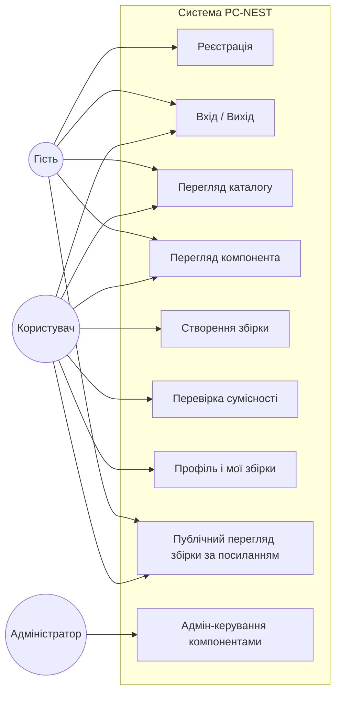
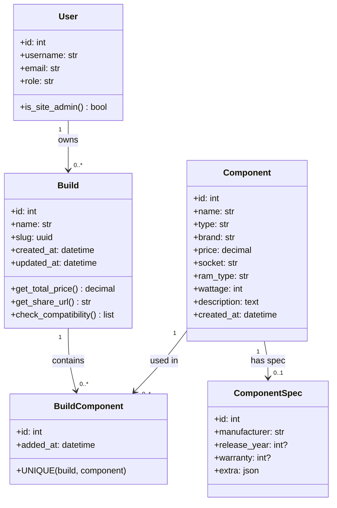
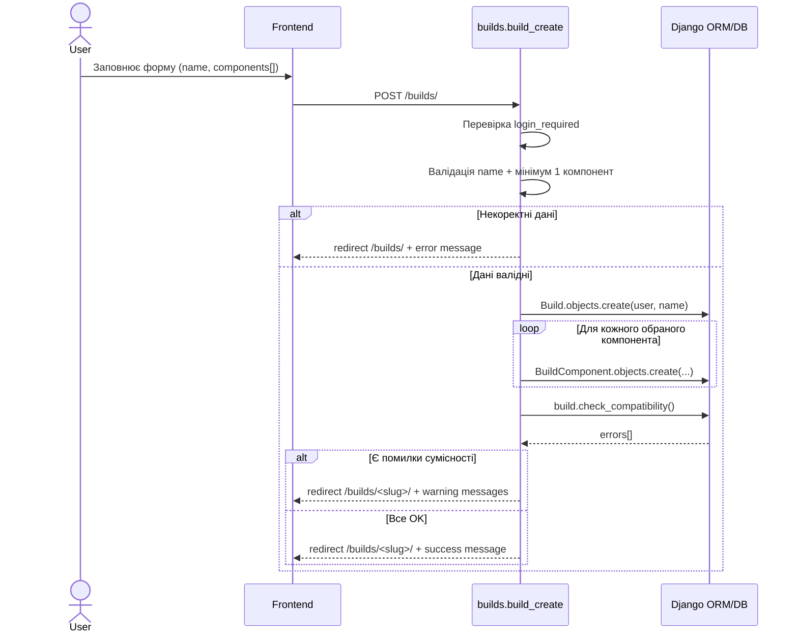

# PC-NEST — UML-діаграми (оновлено під поточний код)

## 1. Діаграма варіантів використання (Use Case)

```mermaid
graph LR
    subgraph Система PC-NEST
        R[Реєстрація]
        L[Вхід / Вихід]
        C[Перегляд каталогу]
        D[Перегляд компонента]
        B[Створення збірки]
        S[Перевірка сумісності]
        P[Профіль і мої збірки]
        SH[Публічний перегляд збірки за посиланням]
        A[Адмін-керування компонентами]
    end

    Guest((Гість)) --> C
    Guest --> D
    Guest --> SH
    Guest --> R
    Guest --> L

    User((Користувач)) --> L
    User --> C
    User --> D
    User --> B
    User --> S
    User --> P
    User --> SH

    Admin((Адміністратор)) --> A
```

## 2. Діаграма класів (Class Diagram)

```mermaid
classDiagram
    direction TB

    class User {
        +id: int
        +username: str
        +email: str
        +role: str
        +is_site_admin() bool
    }

    class Component {
        +id: int
        +name: str
        +type: str
        +brand: str
        +price: decimal
        +socket: str
        +ram_type: str
        +wattage: int
        +description: text
        +created_at: datetime
    }

    class ComponentSpec {
        +id: int
        +manufacturer: str
        +release_year: int?
        +warranty: int?
        +extra: json
    }

    class Build {
        +id: int
        +name: str
        +slug: uuid
        +created_at: datetime
        +updated_at: datetime
        +get_total_price() decimal
        +get_share_url() str
        +check_compatibility() list
    }

    class BuildComponent {
        +id: int
        +added_at: datetime
        +UNIQUE(build, component)
    }

    User "1" --> "0..*" Build : owns
    Build "1" --> "0..*" BuildComponent : contains
    Component "1" --> "0..*" BuildComponent : used in
    Component "1" --> "0..1" ComponentSpec : has spec
```

## 3. Діаграма послідовності — створення збірки

```mermaid
sequenceDiagram
    actor U as User
    participant FE as Frontend
    participant V as builds.build_create
    participant DB as Django ORM/DB

    U->>FE: Заповнює форму (name, components[])
    FE->>V: POST /builds/
    V->>V: Перевірка login_required
    V->>V: Валідація name + мінімум 1 компонент

    alt Некоректні дані
        V-->>FE: redirect /builds/ + error message
    else Дані валідні
        V->>DB: Build.objects.create(user, name)
        loop Для кожного обраного компонента
            V->>DB: BuildComponent.objects.create(...)
        end
        V->>DB: build.check_compatibility()
        DB-->>V: errors[]

        alt Є помилки сумісності
            V-->>FE: redirect /builds/<slug>/ + warning messages
        else Все OK
            V-->>FE: redirect /builds/<slug>/ + success message
        end
    end
```
